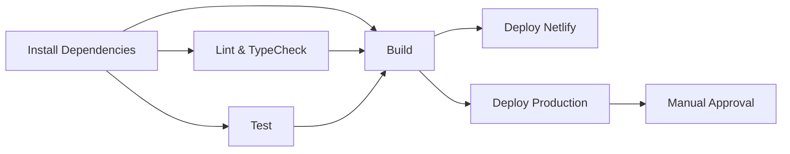

# 🚀 CircleCI Deployment Guide - Pizzeria Senza Cipolla

## 📋 **Overview**
This guide explains how to set up and deploy the Pizzeria Senza Cipolla website using CircleCI for continuous integration and deployment.

## 🏗️ **Project Structure**
```
negoziooo/
├── .circleci/
│   └── config.yml          # CircleCI configuration
├── src/                    # React TypeScript source code
├── public/                 # Static assets
├── dist/                   # Build output (generated)
├── package.json           # Dependencies and scripts
├── vite.config.ts         # Vite build configuration
├── netlify.toml           # Netlify deployment config
└── .env.example           # Environment variables template
```

## ⚙️ **CircleCI Configuration Features**

### **🔄 Workflows:**
1. **build-test-deploy** - Main workflow for all branches
2. **nightly-build** - Scheduled builds at 2 AM UTC

### **📦 Jobs:**
- **install-dependencies** - Install and cache npm packages
- **lint-and-typecheck** - Run ESLint and TypeScript checks
- **test** - Run test suite
- **build** - Build production assets
- **deploy-netlify** - Deploy to Netlify (main/develop branches)
- **deploy-production** - Manual production deployment

## 🔧 **Setup Instructions**

### **1. CircleCI Project Setup**
1. Go to [CircleCI](https://circleci.com/)
2. Sign in with your GitHub account
3. Click "Set Up Project" for your repository
4. Choose "Use existing config" (we have `.circleci/config.yml`)
5. Click "Set Up Project"

### **2. Environment Variables**
Set these in CircleCI Project Settings → Environment Variables:

#### **Required Variables:**
```bash
# Supabase
VITE_SUPABASE_URL=https://htdgoceqepvrffblfvns.supabase.co
VITE_SUPABASE_ANON_KEY=your_supabase_anon_key

# Stripe (if using payments)
VITE_STRIPE_PUBLISHABLE_KEY=your_stripe_key

# Google Maps (if using maps)
VITE_GOOGLE_MAPS_API_KEY=your_google_maps_key

# Netlify Deployment
NETLIFY_SITE_ID=your_netlify_site_id
NETLIFY_AUTH_TOKEN=your_netlify_auth_token
```

### **3. Netlify Setup (if deploying to Netlify)**
1. Create a Netlify account
2. Create a new site from Git
3. Get your Site ID from Site Settings
4. Generate an Auth Token from User Settings → Applications

### **4. Context Setup**
Create these contexts in CircleCI Organization Settings:

#### **netlify-deployment context:**
- NETLIFY_SITE_ID
- NETLIFY_AUTH_TOKEN

#### **production-deployment context:**
- Any production-specific variables

## 🚀 **Deployment Process**

### **Automatic Deployment:**
- **Push to `main`** → Triggers full pipeline → Deploys to production
- **Push to `develop`** → Triggers full pipeline → Deploys to staging
- **Push to other branches** → Runs tests and builds only

### **Manual Deployment:**
- Production deployment requires manual approval
- Go to CircleCI → Workflows → Click "Approve" for production job

## 📊 **Pipeline Stages**



## 🔍 **Monitoring & Debugging**

### **Build Status:**
- Check CircleCI dashboard for build status
- Green ✅ = Success
- Red ❌ = Failed (check logs)

### **Common Issues:**
1. **Environment variables missing** → Check project settings
2. **Build fails** → Check package.json scripts
3. **Deployment fails** → Check Netlify/deployment credentials

### **Logs Location:**
- CircleCI Dashboard → Project → Workflow → Job → Steps

## 📱 **Mobile & Performance**
The build process includes:
- TypeScript compilation
- ESLint code quality checks
- Vite optimization
- Asset minification
- Tree shaking for smaller bundles

## 🔐 **Security**
- Environment variables are encrypted in CircleCI
- No secrets in code repository
- Separate contexts for different environments

## 📞 **Support**
For deployment issues:
1. Check CircleCI build logs
2. Verify environment variables
3. Test locally with `npm run build`
4. Contact development team

---

## 🍕 **Pizzeria Senza Cipolla**
**Address:** C.so Giulio Cesare, 36, 10152 Torino TO  
**Phone:** +393479190907  
**Email:** anilamyzyri@gmail.com

**Repository:** https://github.com/ahmadiiiiiiii198/senza.cipolla
